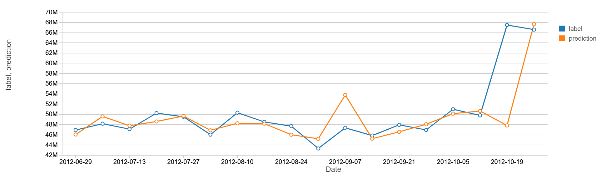
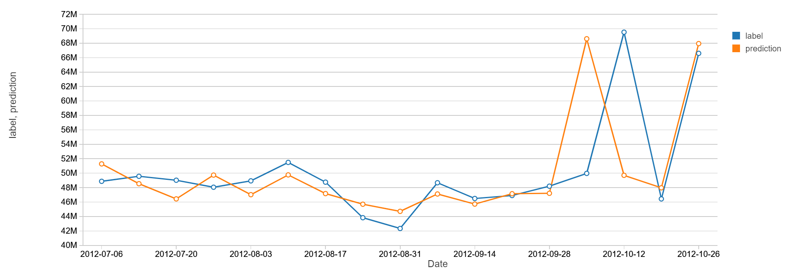
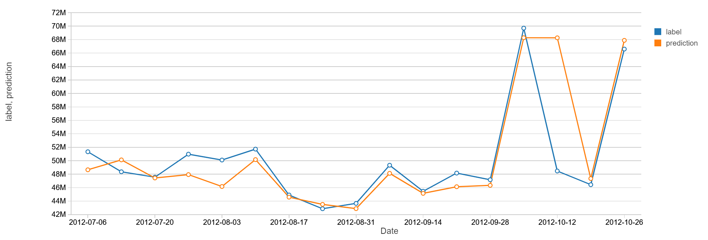
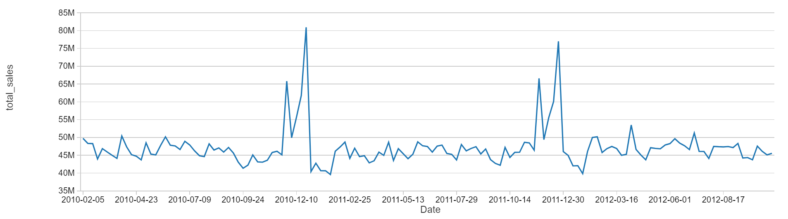
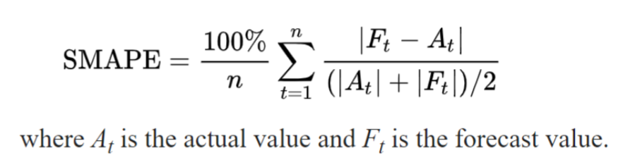

Table of Content:

<!-- START doctoc generated TOC please keep comment here to allow auto update -->
<!-- DON'T EDIT THIS SECTION, INSTEAD RE-RUN doctoc TO UPDATE -->

- [1. Executive Summary](#1-executive-summary)
- [2. Dataset](#2-dataset)
- [3. Modeling](#3-modeling)
  - [3.1. Data Preprocessing and Cleaning](#31-data-preprocessing-and-cleaning)
  - [3.2. Feature Engineering](#32-feature-engineering)
  - [3.3. Time-Series Train-Test Split](#33-time-series-train-test-split)
  - [3.4. Rolling K-Fold CV for Time-Series](#34-rolling-k-fold-cv-for-time-series)
  - [3.5. Hyper-parameter Tuning](#35-hyper-parameter-tuning)
  - [3.6. Evaluation Metrics - sMAPE](#36-evaluation-metrics---smape)
- [4. Results](#4-results)
  - [5. Discussion](#5-discussion)
  - [6. Limitations](#6-limitations)

<!-- END doctoc generated TOC please keep comment here to allow auto update -->

## 1. Executive Summary

Databrick notebook in Spark Scala: https://georgehua.github.io/spark-retail-sales-analysis/

**Goal:** 

Given the available two years data, predict the total sales of a retail company over the next 1 week, 2 weeks and 3 weeks. The evaluation measure is sMAPE.

**Final Model Accuracy Results:**

| Model                     | 1 week    | 2 weeks    | 3 weeks    |
| ------------------------- | --------- | ---------- | ---------- |
| SMA                       | NA        | **2.9556** | 3.2604     |
| Random Forest             | 4.8257    | 5.2812     | 2.7937     |
| Decision Tree             | 6.0747    | 5.4746     | 4.3376     |
| Linear Regression         | 4.7106    | 5.9428     | 11.1154    |
| **Gradient Boosted Tree** | **4.515** | 6.3696     | **2.4636** |

From the results table, we can find GBT model has the best performance, even though it fall short in the 2 weeks prediction window. The prediction and true label comparison plots as below:

Gradient Boosted Tree model prediction for **1 week** window:

Gradient Boosted Tree model prediction for **2 weeks** window:

Gradient Boosted Tree model prediction for **3 weeks** window:

## 2. Dataset

**Stores table** (shape - 45 * 3): Anonymized information about the 45 stores

-  type 
-  size - square feet

**Features table** (shape - 8190 * 12): Contains additional data related to the store, department, and regional activity for the given dates.

- Store - the store number
- Date - the week
- Temperature - average temperature in the region
- Fuel_Price - cost of fuel in the region
- MarkDown1-5 - anonymized data related to promotional markdowns. MarkDown data is only available after Nov 2011, and is not available for all stores all the time. Any missing value is marked with an NA
- CPI - the consumer price index
- Unemployment - the unemployment rate
- IsHoliday - whether the week is a special holiday week

**Sales table** (shape - 421570 * 5): Historical sales data, which covers to 2010-02-05 to 2012-11-01. Within this tab you will find the following fields: 

- Store - the store number
- Dept - the department number
- Date - the week
- Weekly_Sales -  sales for the given department in the given store
- IsHoliday - whether the week is a special holiday week

## 3. Modeling

### 3.1. Data Preprocessing and Cleaning

Since the dataset covers numerous stores, it is difficult to build a model that is able to accommodate each of the individual stores. Therefore, we decided to aggregate all the stores' sales to a weekly total sales column as a whole and use other features to predict the newly created total sales. The target variable “total_sales” is created by the following procedures:

- Joining all the origin tables together by store_id
- Sum up all the store sales for each week
- Detrend total sales. In figure below, we can observe the total sales for this retail store has a seasonality pattern. Thus removing the seasonality could help to make a better prediction. For detrending, we calculated the 1-year lag of the total_sales and redefine the prediction target as the difference between the current value and the last year's value. (The removed seasonality will be mounted back when estimating the accuracy).

### 3.2. Feature Engineering

For each prediction windows (1 - 4 weeks), I created:

- lags
- moving average
- standard deviation

Also, I extracted month and day to capture seasonal changes, the final table before analysis as below:

| Date      | temp        | fuel_price  | unemployment | cpi         | IsHoliday | month | day  | label   | diff_sales | lag_1week | lag_2weeks | lag_3weeks | lag_4weeks | ma_1week  | ma_2weeks   | ma_3weeks   | ma_4weeks   | std_1week   | std_2weeks  | std_3weeks  | std_4weeks  |
| --------- | ----------- | ----------- | ------------ | ----------- | --------- | ----- | ---- | ------- | ---------- | --------- | ---------- | ---------- | ---------- | --------- | ----------- | ----------- | ----------- | ----------- | ----------- | ----------- | ----------- |
| 2/11/2011 | 31.44570456 | 3.163656569 | 8.233422056  | 169.1067819 | 1         | 2     | 11   | 3727189 | 1410796    | 718359    | 4368718    | 7622346    | 7663000    | 2543538.5 | 2543538.5   | 2543538.5   | 2543538.5   | 2581193.603 | 2581193.603 | 2581193.603 | 2581193.603 |
| 2/18/2011 | 45.21960611 | 3.18358438  | 8.244218676  | 169.2342289 | 0         | 2     | 18   | 8101    | 3727189    | 1410796   | 718359     | 4368718    | 7622346    | 1064577.5 | 2165957.667 | 2165957.667 | 2165957.667 | 489626.8982 | 1938809.445 | 1938809.445 | 1938809.445 |
| 2/25/2011 | 42.34485334 | 3.213339359 | 8.243162688  | 169.4908845 | 0         | 2     | 25   | 3443227 | 8101       | 3727189   | 1410796    | 718359     | 4368718    | 2568992.5 | 1952114.667 | 2556265.5   | 2556265.5   | 1637937.198 | 1575764.55  | 1765035.088 | 1765035.088 |
| 3/4/2011  | 43.98275524 | 3.394306626 | 8.242731913  | 169.6180318 | 0         | 3     | 4    | 2737971 | 3443227    | 8101      | 3727189    | 1410796    | 718359     | 1867645   | 1715362     | 1466111.25  | 2046632.6   | 2629792.345 | 1878157.135 | 1612499.063 | 1906604.34  |

Then we try to determine the feature importance for each prediction model with a random forest regressor.

Here's the example of feature importance for the 1 week model (top 10 most relevant features):

| Feature    | Score      |
| ---------- | ---------- |
| diff_sales | 0.51462    |
| std_3weeks | 0.061097   |
| lag_1week  | 0.054614   |
| ma_4weeks  | 0.050618   |
| std_1week  | 0.03887    |
| lag_2weeks | 0.03626    |
| std_2weeks | 0.031121   |
| ma_2weeks  | 0.0304657  |
| std_4weeks | 0.02893861 |
| ma_1week   | 0.02447856 |

### 3.3. Time-Series Train-Test Split

Train test split for time-series data is different from cross-sectional ones, as you cannot use future information to predict the past. So we need to make sure the split is chronological. Also, since time-series data is time-sensitive, the newer data could depend on the past. We want to create a gap between the train set and the test set to ensure there is no data leakage issue. The length of the gap is determined by the sum of max lag and max lead.

### 3.4. Rolling K-Fold CV for Time-Series

For time-series, since we have to prevent data leakage and maintain the original timeline, we use rolling k-fold cross validation with RMSE before integrating it into model optimization processes.

### 3.5. Hyper-parameter Tuning

**LR model** is sensitive to outliers, but this is fixable by penalizing the model with regularization. To optimize the LR model, we tuned the two main hyper-parameters:

- Elastic Net Mixing (α): “Param for the ElasticNet mixing parameter, in the range [0, 1]. For alpha = 0, the penalty is an L2 penalty. For alpha = 1, it is an L1 penalty.” (Apache Spark documentation). L1 (Lasso regression) or L2 (Ridge regression) are techniques to make linear regression less prone to overfitting training data.
- Regularization(λ): Larger Lambda means a stronger regularization effect for L1 or L2

**DT model** is sensitive to the training data and very easy to become overfitting. Tuning the hyperparameters for the DT model is crucial to the model fitness:

- Max Depth: max depth defined the maximum depth of a tree that can be created. The model could be overfitted if the max depth is too high, and the model may not perform well if the max depth is too low
- Max Bins: the parameter of how granular continuous features are discretizing. The larger max bins, the better accuracy, but the more training time.

For optimizing the DT model, we tuned the following hyper-parameters:

- NumTrees: The number of trees that an RF model can utilize to train data. The greater number of trees usually leads to higher accuracy and more computing time. Also, if the training data contains high variance, a larger number of trees might performance worse.
- Max Bins: Same as above, controls the granularity of division.

Pick hyper-parameter for the **GBT model** is very difficult because the model is sensitive to noisy data. For optimizing the DT model, we tuned the following hyper-parameters:

- MaxIteration: The maximum number of iteration controls the number of decision trees to grow. The more iterations, the better performance, but potentially reaching an overfitting state.
- Max Bins: Same as above, controls the granularity of division.
- MaxDepth: Same as above, the maximum depth of a tree that can be created

### 3.6. Evaluation Metrics - sMAPE

The metric we use for the evaluation of our time-series ml models is the symmetric mean absolute percentage error, which is calculated using the function displayed here.  (The absolute difference between At and Ft is divided by half the sum of absolute values of the actual value At and the forecasted value Ft. The value of this calculation is summed for every point t and divided by the number of points n.)

## 4. Results

| Model                     | 1 week    | 2 weeks    | 3 weeks    |
| ------------------------- | --------- | ---------- | ---------- |
| SMA                       | NA        | **2.9556** | 3.2604     |
| Random Forest             | 4.8257    | 5.2812     | 2.7937     |
| Decision Tree             | 6.0747    | 5.4746     | 4.3376     |
| Linear Regression         | 4.7106    | 5.9428     | 11.1154    |
| **Gradient Boosted Tree** | **4.515** | 6.3696     | **2.4636** |

Gradient Boosted Tree model prediction for **1 week** window:

Gradient Boosted Tree model prediction for **2 weeks** window:

Gradient Boosted Tree model prediction for **3 weeks** window:

### 5. Discussion

From the accuracy table, We can observe that with the prediction window increase, the machine learning model could have a lower error rate in general. We can observe the LR and DT model are the worst performance models, as they are naïve and lack prediction ability. Especially, the LR model's sMAPE jump to 11.1 at 3 weeks prediction horizon, since it's sensitive to outliers. RF and GBT models both performed well because they use ensembled techniques, which combine multiple small models to render a more robust prediction power. RF model is a bagging model, which creates a range of decision trees in parallel and averages the results before prediction. And the GBT model utilizes a boosting technique. Different from bagging models, the GBT model builds three models consecutively, where each tree is built to help model the errors made by the previous one. This could convert weaker learners to stronger ones, and ought to be the best model in our selection.

The simple moving average is a statistical model that calculates the unweighted average sales amount based on a predefined rolling window. SMA is good for analyzing long-term trends because it doesn't get affected by small fluctuations. We use SMA as a baseline to compare with machine learning models.

### 6. Limitations

For this project, our sample size is too small (143 rows), which makes it harder to capture seasonality as well as allow machine learning to capture other potential patterns in the dataset. Our recommendation to improve the results for this project is: Increase the size of the dataset Merge other macro-economy data related to retail store sales and use them as new features to predict. And this requires digging into the background of this company (it’s not available in this study because the company is anonymized).